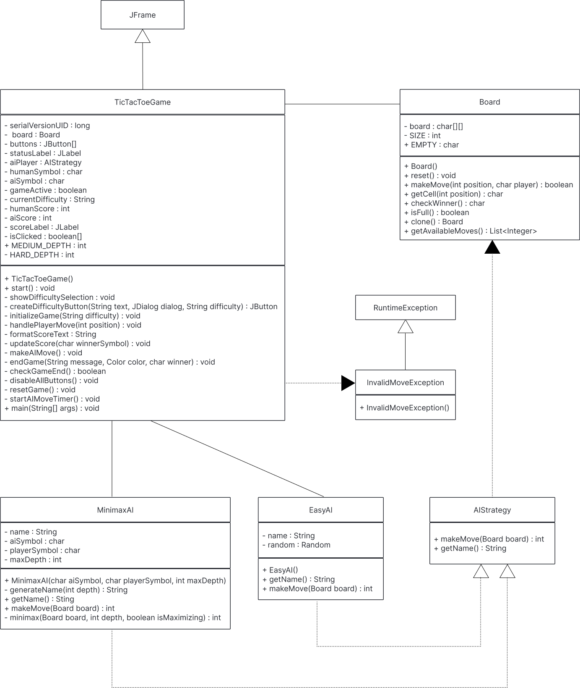
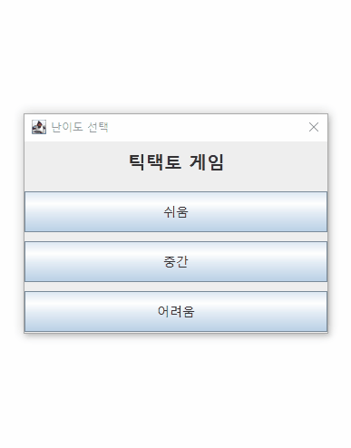
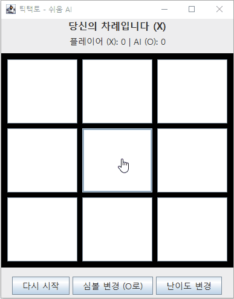

# 🎮 TicTacToe Game (Java Swing)

Java Swing 기반으로 구현한 **틱택토 게임**입니다.  
AI 난이도(쉬움/중간/어려움)를 선택할 수 있으며, **Minimax 알고리즘**과 **랜덤 전략**을 사용합니다.

---

## ⚙️ 주요 기능

- AI 난이도 선택 (쉬움/중간/어려움)
- 점수판 및 심볼(X/O) 변경 기능
- 다시 시작 / 난이도 변경 기능
- 간단한 GUI (Swing 사용)

---

## 🧠 구현 내용

- Minimax 탐색 깊이를 조절하여 난이도 구현
- 쉬움 난이도에서는 `ArrayList`를 사용해 동적으로 빈 칸 탐색
- 이벤트 리스너를 통해 UI와 게임 로직 제어

---

## 🚨 예외 처리 (Exception Handling)

| 상황                                  | 처리 방식                                                                          |
| ------------------------------------- | ---------------------------------------------------------------------------------- |
| 승리 후 잘못된 반환값(-1) 발생 가능성 | 방어적 예외 처리 추가                                                              |
| 이미 채워진 칸을 선택 시              | 예외 발생 가능성이 있으나, UI 단계에서 클릭 자체를 차단하여 실제로는 발생하지 않음 |

---

## 🧩 트러블슈팅 (Troubleshooting)

| 문제                                  | 해결 방법                                         |
| ------------------------------------- | ------------------------------------------------- |
| 난이도 변경 후 게임판 비활성화        | 컴포넌트 초기화 함수 위치 변경                    |
| 재시작 시 난이도 정보 소실            | `currentDifficulty`를 인스턴스 변수로 저장        |
| 클릭된 버튼 비활성화 시 회색으로 변함 | `setEnabled(false)` 대신 플래그(`isClicked`) 사용 |

---

## 인터페이스 사용 이유

`AIStrategy` 인터페이스를 통해 모든 난이도 AI가 공통으로 `makeAIMove()`를 구현하도록 했습니다.  
이를 통해 AI 구현체 간 **공통 규격**을 유지하고, 게임 로직에서는 난이도에 관계없이 **다형성**으로 단일 타입(`AIStrategy`)으로 처리할 수 있습니다.

## 🧾 참고

- **작성자:** 김민식
- **작성일:** 2025-11-03
- **추가 문서:** 예외 및 디버깅 상세 기록 → [Notion 링크](https://www.notion.so/2a0fc6992fc5808298c8ccba374f92a8/)

## 📘 클래스 다이어그램

## 게임 동작 화면

---

## 예외 처리 화면

---
